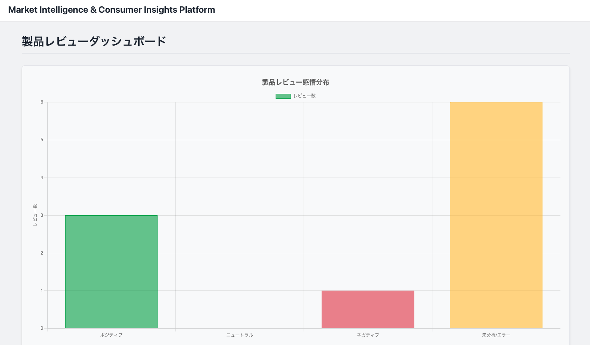
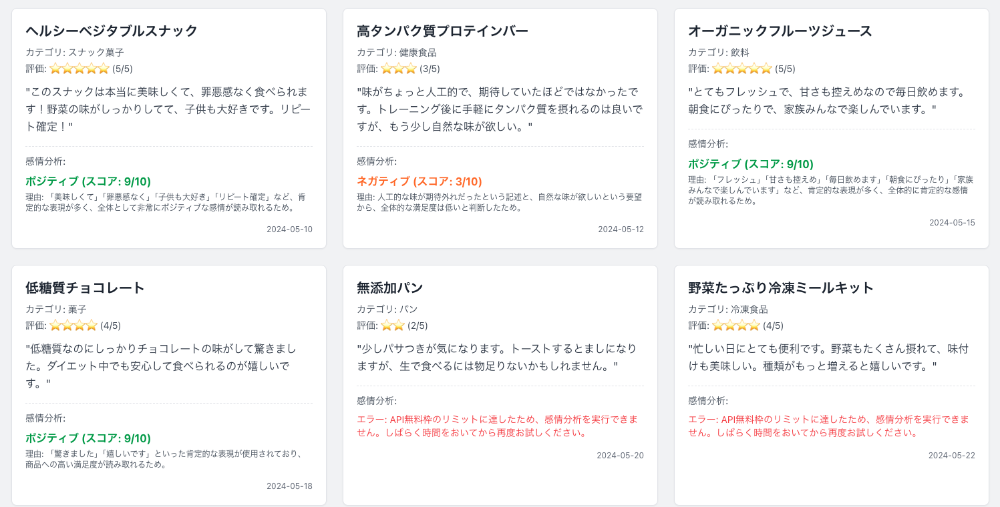
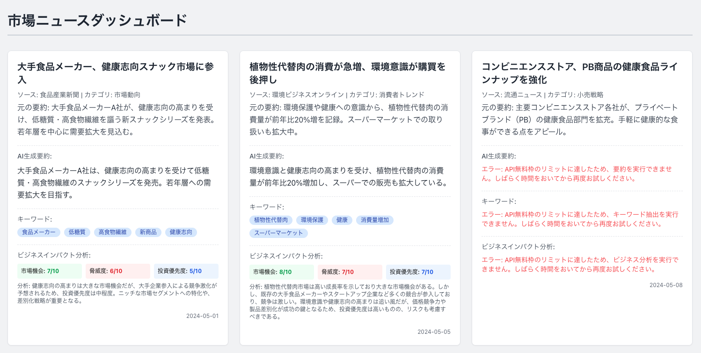
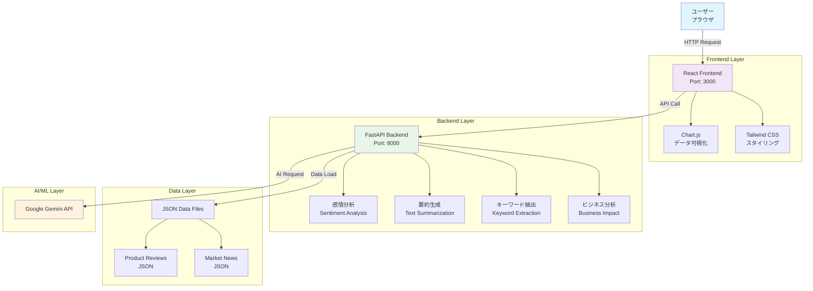
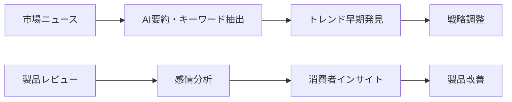

# Market Intelligence & Consumer Insights Platform

[](https://opensource.org/licenses/MIT)
[](https://www.python.org/downloads/)
[](https://reactjs.org/)
[](https://www.typescriptlang.org/)
[](https://fastapi.tiangolo.com/)

## 📊 概要

本プロジェクトは、**事業会社のDX・データ利活用推進職**を想定し、複合的なスキルセット（ドメイン知識、AI・データサイエンス技術、フルスタック開発力）を最大限にアピールするために個人開発したものです。

**Market Intelligence & Consumer Insights Platform**は、市場の動向、消費者の嗜好、競合の状況などを**Google Gemini AI**を活用してリアルタイムに分析し、事業会社の戦略立案や新商品開発、マーケティング活動に具体的な価値を提供するフルスタックWebアプリケーションです。

## 🎯 主な機能と画面

### 📝 製品レビューダッシュボード
消費者の製品レビューを**AI感情分析**により自動解析し、ビジネスインサイトを可視化（※GeminiAPI無料版だと出力に制限がかかります）




**主要機能**
- 感情分析（0-10スケール）による消費者評価の定量化
- Chart.jsによる美しい感情分布グラフ
- リアルタイムAI解析による評価理由の自動抽出
- エラーハンドリングによる安定したUX

### 📰 市場ニュースダッシュボード
業界ニュースをAIで分析し、ビジネスインパクトと戦略的示唆を提供（※GeminiAPI無料版だと出力に制限がかかります）



**主要機能**
- AI要約による重要情報の自動抽出
- キーワード抽出によるトレンド把握
- ビジネスインパクト分析（市場機会・脅威レベル・投資優先度）
- APIクォータ制限対応の順次処理機能

## 🏗️ 技術スタック

### バックエンド
- **FastAPI** (0.111.0) - 高性能なPython Webフレームワーク
- **Google Gemini AI** (0.5.0) - 感情分析、要約、キーワード抽出
- **Uvicorn** - ASGI Webサーバー
- **Pydantic** - データバリデーション
- **Python 3.8+** - コアランタイム

### フロントエンド
- **React** (18.3.1) - モダンなUIライブラリ
- **TypeScript** (4.9.5) - 型安全な開発
- **Tailwind CSS** (3.4.3) - ユーティリティファーストのCSS
- **Chart.js** (4.4.3) - データ可視化
- **React Chart.js 2** (5.2.0) - React用Chart.jsラッパー

### 開発・運用
- **Git** - バージョン管理
- **npm** - パッケージ管理
- **Create React App** - React開発環境
- **Hot Reload** - 開発効率化

## 🔄 システム アーキテクチャ



## 📁 プロジェクト構成

```
market_intelligence_platform/
├── 📁 backend/                    # バックエンドアプリケーション
│   ├── 🐍 main.py                # FastAPI メインアプリケーション
│   ├── 📊 data_loader.py         # データ読み込みユーティリティ
│   ├── 📦 requirements.txt       # Python依存関係
│   └── 📁 data/                  # サンプルデータ
│       ├── 📄 product_reviews.json    # 製品レビューデータ
│       └── 📄 market_news.json        # 市場ニュースデータ
├── 📁 frontend/                   # フロントエンドアプリケーション
│   ├── 📦 package.json           # Node.js依存関係
│   ├── ⚙️ tsconfig.json         # TypeScript設定
│   ├── 🎨 tailwind.config.js     # Tailwind CSS設定
│   └── 📁 src/                   # ソースコード
│       ├── 🏠 App.tsx            # メインアプリケーション
│       ├── 📊 components/        # Reactコンポーネント
│       │   ├── 🛍️ ProductReviewsDashboard.tsx
│       │   └── 📰 MarketNewsDashboard.tsx
│       └── 🎨 index.css          # スタイルシート
├── 📁 docs/                      # ドキュメントと画像
│   └── 📁 images/                # スクリーンショット
├── 📋 README.md                  # プロジェクト説明
├── 🚀 InstallationGuide.md       # セットアップガイド
├── 🔒 .gitignore                 # Git除外設定
└── 🔑 .env                       # 環境変数（要設定）
```

## 🏢 ビジネス課題解決と業績向上への貢献

### 🎯 想定される企業課題

#### 現代の事業会社が直面する主要な課題

**📈 市場変化への迅速な対応**
- 消費者嗜好の多様化・健康志向の高まり
- 競合激化による差別化の必要性
- トレンドの早期キャッチと戦略調整の重要性

**📊 データドリブンな意思決定の強化**
- 経験・勘だけでなく客観的データに基づく判断
- 膨大な市場データの効率的な分析・活用
- 失敗リスクの低減と成功確率の向上

**🚀 新規事業・サービス開発の成功率向上**
- 深い市場洞察と消費者理解の必要性
- 潜在ニーズの発見と製品コンセプト検証
- 開発期間短縮とコスト削減

**💡 AI/DX人材の不足と活用**
- AIやデータサイエンス人材の不足
- 既存プロセスへのAI技術統合の困難
- 内製化能力の向上とベンダー依存の脱却

### 💼 本プラットフォームによる具体的解決策

**📈 市場変化への迅速対応**



- **トレンドの早期発見**: 健康志向、環境意識、時短ニーズなどを自動抽出
- **競合分析の深化**: 新製品発表、キャンペーン、評価を定量的に把握
- **客観的意思決定支援**: 感情分析により消費者の生の声を数値化

**🎯 新規事業開発の成功率向上**
- **潜在ニーズ発見**: レビュー分析による不満点・未充足ニーズの特定
- **コンセプト検証効率化**: AI分析による消費者反応の迅速な把握
- **ターゲット層明確化**: ポジティブ反応層の詳細分析

**💰 マーケティング投資最適化**
- **効果的メッセージング**: 消費者感情に基づくコピー最適化
- **チャネル選定最適化**: 議論が活発なチャネルの特定
- **キャンペーン効果測定**: 実施前後の感情変化追跡

### 📊 想定される投資対効果（ROI）

**短期効果（3-6ヶ月）**
- マーケティング予算効率 **15-20%改善**
- 市場調査工数 **60-70%削減**
- トレンド発見時間 **50%短縮**

**中長期効果（6-18ヶ月）**
- 新製品成功率 **25-30%向上**
- 顧客満足度 **10-15%改善**
- 競合優位性確保による売上 **5-10%増加**

## 👥 ターゲットユーザーと利用シナリオ

### 🎯 想定部門

**📊 経営企画部門**
- 市場全体のトレンド把握
- 新規事業機会の探索
- 競合戦略の策定

**📢 マーケティング部門**
- 消費者インサイトの把握
- プロモーション戦略の立案
- 広告効果測定

**🛍️ 製品開発部門**
- 消費者ニーズに基づく新製品企画
- 既存製品の課題特定と改善

**🔬 研究開発部門**
- 新技術・素材の市場受容性評価
- 将来トレンド予測

### 📝 具体的利用シナリオ

**1. 新製品企画会議**
製品開発担当者が製品レビュー感情分析ダッシュボードを用いて、競合製品や自社既存製品に対する消費者の不満点・高評価点を分析し、新製品コンセプトのヒントを得る。

**2. 四半期マーケティング戦略レビュー**
マーケティング担当者が市場ニュースダッシュボードで業界トレンドや競合動向を把握。AI要約とキーワード抽出を活用し、迅速に市場変化を理解し、戦略に反映。

**3. 危機管理・ブランドモニタリング**
広報担当者が特定製品・ブランドのネガティブ言及急増を感情分析スコア低下で早期検知し、迅速な対応を検討。

**4. 長期戦略策定**
経営企画部門が過去データのトレンド分析と特定キーワードの出現頻度変化を追跡し、将来的な事業ポートフォリオの方向性を検討。

## 🚀 クイックスタート

### 📋 前提条件
- **Python 3.8+** / **Node.js 14+** / **Git**
- **Google Gemini APIキー** ([Google AI Studio](https://aistudio.google.com/)で取得)

### ⚡ 30秒セットアップ

```bash
# 1. リポジトリクローン
git clone https://github.com/yf591/market_intelligence_platform.git
cd market_intelligence_platform

# 2. 環境変数設定
echo 'GEMINI_API_KEY="your_api_key_here"' > .env

# 3. バックエンド起動
cd backend
python3 -m venv .venv && source .venv/bin/activate
pip install -r requirements.txt
uvicorn main:app --reload &

# 4. フロントエンド起動
cd ../frontend
npm install && npm start
```

**アクセス** 
- フロントエンド: http://localhost:3000
- バックエンドAPI: http://localhost:8000/docs

詳細なセットアップ手順は [InstallationGuide.md](InstallationGuide.md) をご参照ください。

## 📈 主要API機能

### 🔗 エンドポイント一覧

| エンドポイント | 機能 | 説明 |
|---|---|---|
| `GET /api/product-reviews` | レビューデータ取得 | 全製品レビューのリスト |
| `GET /api/market-news` | ニュースデータ取得 | 市場ニュースのリスト |
| `POST /api/analyze-sentiment` | 感情分析 | テキストの感情スコア(0-10)と理由 |
| `POST /api/summarize-text` | 要約生成 | 長文テキストの簡潔な要約 |
| `POST /api/extract-keywords` | キーワード抽出 | 重要キーワードの自動抽出 |
| `POST /api/analyze-business-impact` | ビジネス分析 | 市場機会・脅威・投資優先度の評価 |

### 🔑 Gemini AI統合

**感情分析例**
```json
{
  "sentiment": "ポジティブ",
  "score": 8.5,
  "reason": "「美味しい」「リピート確定」など非常に好意的な表現が多数使用されている"
}
```

**ビジネスインパクト分析例**
```json
{
  "market_opportunity": 7,
  "threat_level": 3,
  "investment_priority": 8,
  "business_impact": "植物性代替肉市場の急成長により新規参入機会が高く、投資優先度が高い"
}
```

## 🛡️ エラーハンドリング

### 💪 堅牢性設計

**APIクォータ制限対応**
- 順次処理によるレート制限回避
- 自動リトライ機能
- ユーザーフレンドリーなエラーメッセージ

**ネットワークエラー対応**
- タイムアウト設定
- 接続エラー時の代替表示
- ローディング状態の適切な管理

**データ検証**
- Pydanticによる型安全なAPI
- フロントエンドでの入力値検証
- 不正データの適切な処理

## 🔮 今後の拡張計画

### 🎯 短期目標（3-6ヶ月）
- **リアルタイムSNSデータ**連携（Twitter API等）
- **詳細フィルタリング**機能（期間・カテゴリ別）
- **カスタムレポート**生成機能
- **アラート機能**（閾値ベースの通知）

### 🚀 中長期目標（6-18ヶ月）
- **PostgreSQL**による本格データベース導入
- **機械学習モデル**による消費者行動予測
- **多言語対応**（グローバル展開）
- **ユーザー認証・権限管理**
- **BI ツール連携**（Tableau、Power BI等）

### 💡 AIモデル高度化
- **マルチモーダル分析**（テキスト+画像）
- **時系列分析**による将来予測
- **カスタムAIモデル**のファインチューニング
- **リアルタイム学習**機能

## 🤝 貢献・サポート

- **開発者**: yf591
- **GitHub**: [market_intelligence_platform](https://github.com/yf591/market_intelligence_platform)
- **ライセンス**: MIT License

### 🔧 開発参加

1. リポジトリをフォーク
2. 機能ブランチを作成 (`git checkout -b feature/amazing-feature`)
3. 変更をコミット (`git commit -m 'Add amazing feature'`)
4. ブランチにプッシュ (`git push origin feature/amazing-feature`)
5. プルリクエストを作成


---