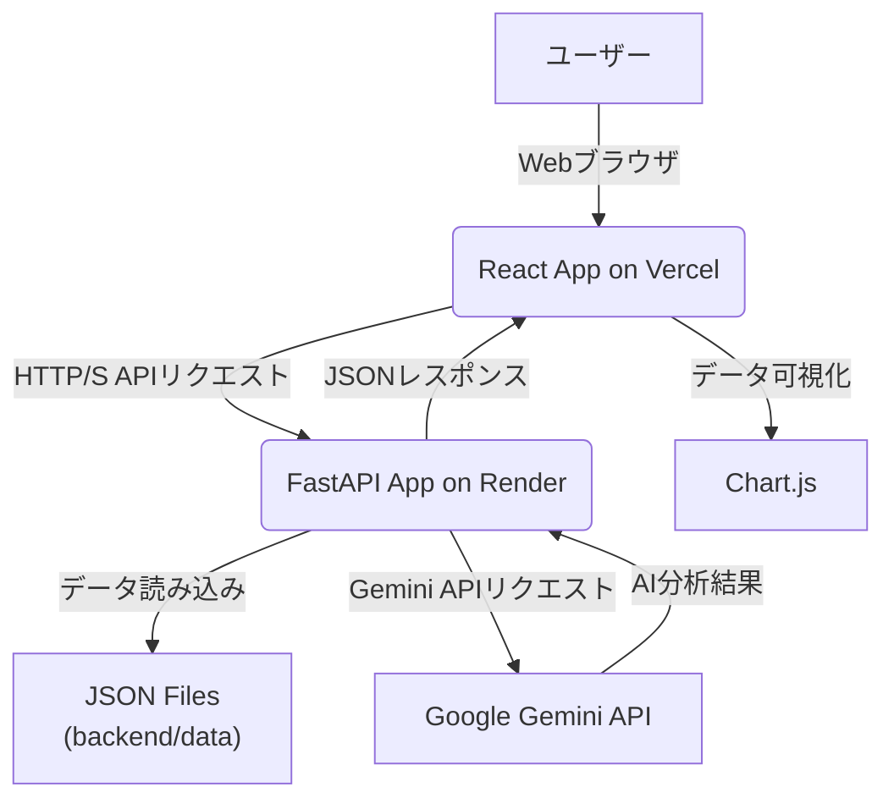

# Market Intelligence & Consumer Insights Platform

## 概要

本プロジェクトは、事業会社のDX・データ利活用推進職を想定し、複合的なスキルセット（人事・労務の深いドメイン知識、AI・データサイエンス技術、フルスタック開発力）を最大限にアピールするために個人開発したものである。

「Market Intelligence & Consumer Insights Platform」は、市場の動向、消費者の嗜好、競合の状況などをAIを活用して分析し、事業会社の事業戦略立案や新商品開発、マーケティング活動に貢献することを目的としています。

## 1. 要件定義とビジネス課題解決

### 1.1. ビジネス課題

ここで想定している企業は、中核となる主事業を保有しつつも、医薬品事業や加工食品事業など多角的な事業展開を進めています。しかし、現代のビジネス環境は急速に変化しており、特に以下の課題に直面していると考えられます。

*   **市場変化への迅速な対応**
  消費者の嗜好の多様化、健康志向の高まり、競合の激化など、市場の変化が加速しており、これに迅速に対応するための情報収集・分析能力が求められています。
*   **データドリブンな意思決定の強化**
  経験や勘に頼るだけでなく、客観的なデータに基づいた意思決定の重要性が増しています。特に、膨大な市場データや消費者データを効率的に分析し、戦略に活かす仕組みが不足している可能性があります。
*   **新規事業・サービス開発の成功率向上**
  新しい市場機会を発見し、競争力のある製品やサービスを開発するためには、深い市場洞察と消費者理解が不可欠です。しかし、これらの情報を体系的に収集・分析するプロセスが確立されていない場合、開発リスクが高まります。
*   **マーケティング投資の最適化**
  限られたリソースの中で、最も効果的なマーケティング戦略を立案し、投資対効果を最大化するためには、消費者インサイトに基づいた精密なターゲティングとメッセージングが必要です。
*   **AI/DX人材の不足と活用**
  多くの企業が直面する課題として、AIやデータサイエンスを活用できる人材の不足、および既存のビジネスプロセスへのAI技術の統合が挙げられます。これにより、DX推進が遅れる可能性があります。

### 1.2. 本アプリによる課題解決と業績向上への貢献

本「Market Intelligence & Consumer Insights Platform」は、上記の架空の事業会社が直面するビジネス課題に対し、AIとデータサイエンスの力を活用して具体的な解決策を提供し、ひいては業績向上に貢献することを目指しています。

#### 1.2.1. 市場変化への迅速な対応とデータドリブンな意思決定の強化

本プラットフォームは、市場ニュースや製品レビューといった非構造化データをAI（Gemini API）を用いてリアルタイムに近い形で分析します。これにより、以下のような貢献が可能です。

*   **トレンドの早期発見**
  食品・飲料業界における健康志向、環境意識、時短ニーズなどのトレンドを、ニュース記事やSNSの言及から自動的に抽出し、可視化します。これにより、市場の変化の兆候を早期に捉え、迅速な戦略調整を可能にします。
*   **競合分析の深化**
  競合他社の新製品発表、マーケティングキャンペーン、消費者からの評価などを自動的に収集・分析し、競合の強み・弱み、市場でのポジショニングを明確にします。これにより、自社の競争戦略をよりデータに基づいて立案できます。
*   **客観的な意思決定支援**
  感情分析やキーワード抽出により、消費者の「生の声」を定量的に把握し、製品改善やサービス開発の優先順位付けに役立てます。これにより、経験や勘だけでなく、客観的なデータに基づいた意思決定を促進し、失敗のリスクを低減します。

#### 1.2.2. 新規事業・サービス開発の成功率向上

消費者インサイトの深い理解は、新規事業・サービス開発の成否を大きく左右します。本プラットフォームは、以下の点で貢献します。

*   **潜在ニーズの発見**
  製品レビューの感情分析やキーワード抽出を通じて、消費者が既存製品に抱く不満点や、満たされていないニーズを特定します。これにより、市場に受け入れられやすい新製品のアイデア創出を支援します。
*   **コンセプト検証の効率化**
  新しい製品コンセプトやマーケティングメッセージに対する消費者の反応を、SNSデータなどから迅速に分析し、開発の初期段階で軌道修正を可能にします。これにより、開発期間の短縮とコスト削減に繋がります。
*   **ターゲット層の明確化**
  どのような層の消費者が、どのような製品特性にポジティブな反応を示しているかを分析することで、新製品のターゲット層をより明確にし、効果的なプロモーション戦略を立案できます。

#### 1.2.3. マーケティング投資の最適化

本プラットフォームは、マーケティング活動の効率化と効果最大化に寄与します。

*   **効果的なメッセージング**
  消費者が製品やブランドに対してどのような言葉や感情を抱いているかを分析することで、広告コピーやプロモーションメッセージを最適化し、より響くコミュニケーションを実現します。
*   **チャネル選定の最適化**
  特定の製品やターゲット層が、どのオンラインチャネルで活発に議論されているかを分析することで、マーケティング予算を最も効果的なチャネルに配分し、ROIを向上させます。
*   **キャンペーン効果測定の強化**
  マーケティングキャンペーン実施前後の消費者感情やキーワードの変化を追跡することで、キャンペーンの効果を定量的に評価し、次回の改善に繋げます。

#### 1.2.4. AI/DX人材の活用と組織全体のDX推進

本アプリケーションは、候補者自身のAI/DXスキルを具体的に示すだけでなく、社内でのAI活用を促進するモデルケースとなり得ます。

*   **AI活用の具体例提示**
  複雑な自然言語処理タスク（感情分析、要約、キーワード抽出）をAIがどのように実用的なビジネスインサイトに変換できるかを示します。これにより、社内の他部門におけるAI活用の可能性を啓蒙し、DXへの理解を深めます。
*   **データサイエンスの民主化**
  直感的で使いやすいダッシュボードを通じて、非技術系のビジネスユーザーでもAIによる分析結果にアクセスし、意思決定に活用できるようになります。これにより、データドリブンな文化を組織全体に浸透させます。
*   **内製化の推進**
  候補者がこのアプリケーションをゼロから開発した経験は、社内でのAIソリューションの内製化能力を高めることに貢献します。外部ベンダーに依存することなく、自社で迅速に課題解決できる体制構築の一助となります。

### 1.3. ターゲットユーザーと利用シナリオ

本プラットフォームは、社内の以下のような部門の担当者を主要なターゲットユーザーとして想定しています。

*   **経営企画部門**
  市場全体のトレンド把握、新規事業機会の探索、競合戦略の策定。
*   **マーケティング部門**
  消費者インサイトの把握、製品プロモーション戦略の立案、広告効果測定。
*   **製品開発部門**
  消費者ニーズに基づいた新製品の企画・改善、既存製品の課題特定。
*   **研究開発部門**
  新しい技術や素材に対する市場の受容性評価、将来的なトレンド予測。

**利用シナリオ例**

1.  **新製品企画会議**
   製品開発担当者が、本プラットフォームの製品レビュー感情分析ダッシュボードを用いて、競合製品や自社既存製品に対する消費者の不満点や高評価点を分析。そこから新たな製品コンセプトのヒントを得る。
2.  **四半期マーケティング戦略レビュー**
   マーケティング担当者が、市場ニュースダッシュボードで業界全体のトレンドや競合の動きを把握。AI生成要約とキーワード抽出を活用し、市場の主要な変化点を迅速に理解し、自社のマーケティング戦略に反映させる。
3.  **危機管理・ブランドモニタリング**
   広報担当者が、特定の製品やブランドに関するネガティブな言及（レビューやニュース）が急増していないかをモニタリング。感情分析のスコア低下を早期に検知し、迅速な対応を検討する。
4.  **長期戦略策定**
   経営企画部門が、過去数年間の市場ニュースのトレンド分析や、特定のキーワードの出現頻度変化を追跡し、将来的な事業ポートフォリオの方向性を検討する。

## 2. 機能一覧

本プラットフォームは、以下の主要な機能を提供します。

*   **製品レビューダッシュボード**
    *   加工食品などの製品レビューデータの表示。
    *   各レビューに対するAI（Gemini API）による**感情分析**（ポジティブ、ネガティブ、ニュートラル、スコア、理由）。
    *   製品レビュー全体の感情分布を可視化する**棒グラフ**。
*   **市場ニュースダッシュボード**
    *   食品・飲料業界や関連市場のニュースヘッドラインデータの表示。
    *   各ニュースの要約（`content_summary`）に対するAI（Gemini API）による**詳細要約**。
    *   各ニュースからAI（Gemini API）による**主要キーワード抽出**。

## 3. 技術スタック

本プロジェクトは、ゼロコストでの個人開発を念頭に置き、無料利用枠が充実している技術を中心に選定しています。これにより、高いパフォーマンスと拡張性を確保しつつ、コストを最小限に抑えています。

### 3.1. フロントエンド

*   **React**
  ユーザーインターフェース構築のためのJavaScriptライブラリ。コンポーネントベースの開発により、再利用性と保守性を高めています。
*   **TypeScript**
  JavaScriptに静的型付けを導入し、開発時のエラーを減らし、コードの品質と可読性を向上させています。
*   **Tailwind CSS**
  ユーティリティファーストのCSSフレームワーク。高速なUI開発と、カスタマイズ性の高いデザインを実現しています。
*   **Chart.js / react-chartjs-2**
  データ可視化のための強力なライブラリ。製品レビューの感情分布などを直感的でインタラクティブなグラフで表示します。

### 3.2. バックエンド

*   **FastAPI**
  Python製の高速なWebフレームワーク。非同期処理に対応しており、AIモデルとの連携やAPIの構築に最適です。自動生成されるAPIドキュメント（Swagger UI/ReDoc）も開発効率を高めます。
*   **Python**
  データ処理、AI/MLモデルの実行、API構築など、幅広い用途で使用される汎用プログラミング言語。
*   **Uvicorn**
  ASGI（Asynchronous Server Gateway Interface）サーバー。FastAPIアプリケーションを高速で動作させます。

### 3.3. AI/ML

*   **Google Gemini API**
  Googleが提供する最先端のマルチモーダルAIモデル。自然言語処理能力を活用し、製品レビューの感情分析、市場ニュースの要約、キーワード抽出といった主要なAI機能を実現しています。無料利用枠が充実しており、個人開発に適しています。

### 3.4. データベース (モックデータ)

*   **JSONファイル**
  現在は、`backend/data`ディレクトリ内のJSONファイルにモックデータを格納しています。これにより、開発初期段階での迅速なプロトタイピングと機能検証を可能にしています。将来的な拡張として、PostgreSQLなどの本格的なデータベースへの移行を想定しています。

### 3.5. デプロイ

*   **Vercel**
  フロントエンド（React）のデプロイに利用。GitHub連携によりCI/CDを自動化し、高速なデプロイとスケーラビリティを提供します。無料枠が充実しています。
*   **Render**
  バックエンド（FastAPI）のデプロイに利用。Pythonアプリケーションのデプロイが容易で、環境変数の管理や自動ビルド機能を提供します。無料枠があります。

## 4. アーキテクチャと技術連携図

本アプリケーションは、フロントエンドとバックエンドが分離されたモダンなマイクロサービスアーキテクチャを採用しています。これにより、各コンポーネントの独立した開発、デプロイ、スケーリングが可能となり、高い柔軟性と保守性を実現しています。

以下に、主要なコンポーネント間の連携を示すMermaid記法による図を示します。



**連携フロー**

1.  **ユーザーアクセス**
   ユーザーはWebブラウザを通じてVercelにデプロイされたReactアプリケーションにアクセスします。
2.  **データリクエスト**
   Reactアプリケーションは、表示に必要なデータ（製品レビュー、市場ニュース）をRenderにデプロイされたFastAPIバックエンドにHTTP/Sリクエストとして送信します。
3.  **データ処理**
   FastAPIバックエンドは、リクエストに応じて`backend/data`ディレクトリ内のJSONファイルからモックデータを読み込みます。
4.  **AI分析**
   製品レビューの感情分析、市場ニュースの要約・キーワード抽出が必要な場合、FastAPIはGoogle Gemini APIに対してテキストデータと分析指示を送信します。
5.  **AI結果取得**
   Google Gemini APIは、AI分析結果（感情、要約、キーワードなど）をFastAPIに返します。
6.  **レスポンス生成**
   FastAPIは、取得したデータとAI分析結果を統合し、JSON形式でReactアプリケーションに返します。
7.  **データ表示と可視化**
   Reactアプリケーションは、受け取ったJSONデータを解析し、UI上に表示します。Chart.jsライブラリを使用して、感情分布などのデータをグラフとして可視化します。

## 5. リポジトリ構成

本プロジェクトのリポジトリは、フロントエンドとバックエンドを明確に分離したモノレポ構成を採用しています。これにより、関連するコードを一つのリポジトリで管理しつつ、各サービスの独立性を保っています。

```
market_intelligence_platform/
├── backend/                     # FastAPIバックエンドアプリケーション
│   ├── data/                    # モックデータ（JSONファイル）
│   │   ├── product_reviews.json
│   │   └── market_news.json
│   ├── data_loader.py           # モックデータ読み込みモジュール
│   ├── main.py                  # FastAPIアプリケーションのエントリーポイント
│   └── requirements.txt         # Python依存関係リスト
├── frontend/                    # Reactフロントエンドアプリケーション
│   ├── public/                  # 静的アセット
│   ├── src/                     # Reactソースコード
│   │   ├── components/          # 再利用可能なUIコンポーネント
│   │   │   ├── MarketNewsDashboard.tsx
│   │   │   └── ProductReviewsDashboard.tsx
│   │   ├── App.tsx              # メインアプリケーションコンポーネント
│   │   ├── index.css            # Tailwind CSSのインポートと基本スタイル
│   │   ├── index.tsx            # Reactアプリケーションのエントリーポイント
│   │   └── reportWebVitals.ts   # パフォーマンス測定用モジュール
│   ├── package.json             # Node.js/npm依存関係とスクリプト
│   ├── postcss.config.js        # PostCSS設定（Tailwind CSS用）
│   └── tailwind.config.js       # Tailwind CSS設定
└── README.md                    # このREADMEファイル
```

## 6. セットアップと実行方法

本アプリケーションをローカル環境でセットアップし、実行するための手順を説明します。

### 6.1. 前提条件

*   **Python 3.8+**: バックエンドの実行に必要です。
*   **Node.js 14+ & npm (または Yarn)**: フロントエンドの実行に必要です。
*   **Git**: リポジトリのクローンに必要です。
*   **Google Gemini APIキー**: AI機能を利用するために必要です。Google AI Studioで取得できます。

### 6.2. リポジトリのクローン

まず、GitHubリポジトリをローカルにクローンします。

```bash
git clone https://github.com/yf591/market_intelligence_platform.git
cd market_intelligence_platform
```

### 6.3. バックエンドのセットアップと実行

1.  **Python仮想環境の作成とアクティベート**
    ```bash
    cd backend
    python3 -m venv .venv
    source .venv/bin/activate  # macOS/Linux
    # .venv\Scripts\activate   # Windows
    ```
2.  **依存関係のインストール**
    ```bash
    pip install -r requirements.txt
    ```
3.  **Gemini APIキーの設定**
    FastAPIアプリケーションを起動する前に、Gemini APIキーを環境変数として設定します。**セキュリティのため、コードに直接書き込まないでください。**
    ```bash
    # macOS/Linux
    export GEMINI_API_KEY="YOUR_GEMINI_API_KEY"
    # Windows (CMD)
    set GEMINI_API_KEY="YOUR_GEMINI_API_KEY"
    # Windows (PowerShell)
    $env:GEMINI_API_KEY="YOUR_GEMINI_API_KEY"
    ```
    `YOUR_GEMINI_API_KEY` を実際に取得したAPIキーに置き換えてください。
4.  **FastAPIアプリケーションの実行**
    ```bash
    uvicorn main:app --reload
    ```
    これにより、バックエンドサーバーが `http://127.0.0.1:8000` で起動します。

### 6.4. フロントエンドのセットアップと実行

1.  **依存関係のインストール**
    ```bash
    cd ../frontend # バックエンドディレクトリから移動
    npm install
    # または yarn install
    ```
2.  **APIベースURLの設定**
    ローカル開発環境では、バックエンドが `http://localhost:8000` で動作するため、特に設定は不要です。デプロイ時にはVercelの環境変数で設定します。
3.  **Reactアプリケーションの実行**
    ```bash
    npm start
    # または yarn start
    ```
    これにより、React開発サーバーが起動し、通常はブラウザで `http://localhost:3000` が自動的に開きます。

## 7. デプロイガイド

本アプリケーションは、VercelとRenderの無料枠を利用してデプロイ可能です。以下に概要を説明します。

### 7.1. フロントエンド (React) のデプロイ - Vercel

1.  **Vercelアカウントの作成/ログイン**
   GitHubアカウントでサインアップ/ログインします。
2.  **新しいプロジェクトのインポート**
   GitHubリポジトリをVercelにインポートします。
3.  **設定**
   ルートディレクトリを `frontend` に設定します。Vercelが自動的にReactプロジェクトを認識します。
4.  **デプロイ**
   Vercelが自動的にビルドし、デプロイします。デプロイ完了後、URLが提供されます。
5.  **環境変数**
   デプロイ後、Vercelプロジェクトの設定で `REACT_APP_API_BASE_URL` 環境変数を追加し、RenderでデプロイしたバックエンドのURLを設定します。

### 7.2. バックエンド (FastAPI) のデプロイ - Render

1.  **Renderアカウントの作成/ログイン**
   GitHubアカウントでサインアップ/ログインします。
2.  **新しいWebサービスの作成**
   GitHubリポジトリをRenderに接続します。
3.  **設定**
    *   ルートディレクトリを `backend` に設定します。
    *   ランタイムを `Python 3` に設定します。
    *   ビルドコマンドを `pip install -r requirements.txt` に設定します。
    *   スタートコマンドを `uvicorn main:app --host 0.0.0.0 --port $PORT` に設定します。
    *   インスタンスタイプを `Free` に設定します。
4.  **環境変数**
   `GEMINI_API_KEY` をあなたのGemini APIキーに設定します。また、`PYTHONUNBUFFERED` を `1` に設定します。
5.  **デプロイ**
   Renderが自動的にビルドし、デプロイします。デプロイ完了後、URLが提供されます。

## 8. 今後の展望と拡張性

本プラットフォームは、事業会社のDX推進における強力なツールとなる可能性を秘めており、以下のような機能拡張が考えられます。

*   **データソースの多様化**
    *   SNSデータ（Twitter, Instagramなど）からのリアルタイムな消費者感情分析。
    *   ECサイトの商品レビューデータ連携。
    *   ニュースサイト、業界レポート、学術論文などからの情報収集。
*   **高度なAI分析機能**
    *   消費者行動予測モデルの導入（購買履歴、閲覧履歴などに基づく）。
    *   新商品投入シミュレーションと売上予測。
    *   マーケティングキャンペーンのROI最適化提案。
    *   画像認識による商品画像分析（競合製品のデザイン傾向など）。
*   **ユーザーインターフェースの強化**
    *   よりインタラクティブなダッシュボード（ドリルダウン、フィルタリング、期間指定など）。
    *   カスタムレポート生成機能。
    *   アラート機能（特定のキーワードや感情スコアの急変を通知）。
*   **データベースの本格導入**
    *   PostgreSQLなどのリレーショナルデータベースを導入し、大規模なデータ管理と複雑なクエリに対応。
    *   データウェアハウス（例: Google BigQuery, Snowflake）との連携。
*   **認証・認可機能**
    *   ユーザー管理とロールベースのアクセス制御を実装し、セキュリティを強化。
*   **多言語対応**
    *   グローバル企業である事業会社のニーズに対応するため、多言語でのデータ分析とUI表示。

## 9. 貢献とライセンス

本プロジェクトは、yf591が個人開発したものです。

**ライセンス**: MIT License

---

